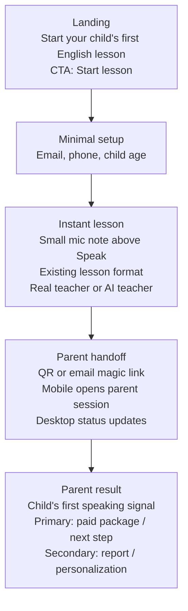

# NovaKid Activation Reinvention

# 0. Test task

Background: NovaKid currently uses a standard "Linear Funnel".

Part 1: The Analysis
Your first task is to identify the funnel steps and list where drop offs may occur. Explore the funnel by going through the process yourself.
Review the following hypothetical data snippet:
Only 10% of visitors start the quiz
Of these, 40% become a lead (leave their phone number)
Metric: We see better conversions on mobile (x2), but most of our traffic comes from web.
Question: What are your three immediate hypotheses for why the funnel is failing? Which segment (Mobile or Desktop) would you prioritize fixing first and why?

Part 2: The Reinvention
Instead of "tweaking" the current funnel and changing buttons and colours, propose one entirely new "Activation Path" that ignores the current linear flow.
How would you get the child to experience the "Aha!" moment (actually speaking English with a tutor or AI) faster?
How would you integrate a "Premium" tier upsell into this new flow without bcreating massive friction?
Deliverable: A rough wireframe sketch (hand-drawn or digital) and a 1-page logic summary.

Part 3: The Experimentation Roadmap (30 mins)
You have 2 weeks and 1 developer/ 1 designer to test your "Reinvention" from Part 2.
What is your Minimum Viable Test (MVT)?
Which "North Star" metric determines success?
If the test fails, what data points would you look at to decide whether to iterate or kill the project?

## 1. Funnel Analysis

Assumption: I read **web** as desktop web and **mobile** as mobile web, excluding native app. If app traffic is included, I would split desktop web / mobile web / app before prioritizing.

Current funnel:

`Visit -> CTA / quiz start -> long parent quiz -> account (email) -> phone + name -> email code -> child details + plan / trial booking -> success screen -> profile selection -> wait / lesson confirmation (email / calls) -> trial lesson -> purchase`

Main drop-offs:

- **Visit -> quiz start:** only 10% start the quiz. The problem starts before the quiz mechanics.
- **Quiz -> lead:** 40% of quiz starters become leads, so visitor-to-lead conversion is only ~4%.
- **Lead -> trial:** no data provided, but the observed UX suggests risk around email verification, booking, confirmation, and calls.
- **Trial -> purchase:** no data provided

Three immediate hypotheses:

1. **Lead capture is too late and over-gated.** The funnel asks parents to complete the long quiz before the business-critical lead action. I would move phone capture immediately after the child's age segment. Rich quiz questions, email verification, and personalization can move to the waiting period before the first lesson. This should increase visitor-to-lead conversion without removing qualification entirely.
2. **Failed trial recovery is too complex.** If the first trial lesson does not happen, the parent should not be pushed into teacher discovery / catalog flow. My hypothesis: first-trial recovery should always be simplified: date/time first, automatic teacher matching. This should improve rebooking and reduce lead waste after no-shows, cancellations, or technical failures.
3. **Parent conversion tasks belong on mobile; the child experience belongs on desktop.** Mobile converts 2x better, while most traffic starts on web. I would test a magic-link handoff: parent verifies email on mobile, the desktop session updates automatically, and subsequent parent actions - confirmation, reminders, schedule, payment - continue on mobile; the same link also works if the parent opens it on desktop.

Priority: **desktop web first**. Before launch, I would split both segments by traffic source; if mobile wins in revenue or LTV, desktop should borrow mobile's immediacy rather than port the current desktop funnel.

## 2. New Activation Path: "First English Minute"

Core idea: **make the child speak English before the parent completes the full funnel, with mic use explained inline instead of as a heavy separate gate.**

Proposed path:

1. Parent clicks: **"Start your child's first English lesson."**
2. Parent gives only email, phone number, age.
3. Parent or child taps **Speak** and the child starts the existing trial lesson format immediately with a real teacher or AI teacher. A minimal line above the button explains that the mic is used for the live check.
4. Parent handoff: QR / email magic link opens an authorized parent session on mobile and updates desktop status.
5. Parent sees:
   - Primary: reserve trial live lesson or set schedule
   - Secondary: view AI report, answer personalization questions
6. Trial start:
6.1. With current product
   - The instant lesson becomes the first trial experience; after it, the parent can buy any paid package.
6.2. With new subscription product
   - Parent starts a card-backed trial and the child can begin immediately:
      - live lesson with a human teacher OR
      - live lesson with an AI teacher.
7. Premium upsell:
7.1. With current product
   - After the first AI/human session ended, we can offer based on the child's and teacher's feedback:
      - **"Premium subscription: Learn faster with native speakers"**;
      - **"Group lessons: Learn and make friends"**;
7.2. With new product
   - When we see that there is an issue to schedule a live lesson (no booking, no-shows, cancellations)
      - **"Premium subscription: Immediate lesson with AI teacher"**;
   - When parent has completed the long quiz:
      - **"Premium subscription: Personalized learning program for {child_name}"**;

Target flow wireframe:

## 3. Experimentation Roadmap

### **Product Iterations Roadmap:**

1. **The Instant Trial (MVT - 2 weeks scope).** Reduce the quiz to minimal setup and move the existing trial lesson immediately after it, using the current lesson room and standby teachers. This tests the core value hypothesis: immediate lesson -> higher paid intent.
2. **The Parent Handoff.** Add magic link / QR, second-device parent experience, and delayed parent questionnaire while the child is in the lesson.
3. **The AI Scale.** Replace live standby supply for instant starts with AI once the value loop is proven; focus on CAC, availability, and unit economics.
4. **The New Economics.** Add subscription model and upsell flows after the core activation path works.

### **The Instant Trial (MVT - 2 weeks scope).**

- **WHAT:** Move the existing first lesson before the long quiz and measure conversion to any paid package.
- **WHY:** Test whether immediate child value creates enough parent trust to buy.
- **HOW:** First check historical correlation: time-to-trial vs. paid conversion. Then run an A/B test with real teachers in limited availability windows.

### **MVT:**

Changes summary:

**A/B test design:**

- **Control:** current funnel.
- **Test:** minimal setup (email, phone, child age) -> instant existing-format trial lesson -> current prod post-lesson flow / paid package offer.

**Details:**

- Size standby teacher capacity before launch: available teacher minutes / average trial duration -> max instant lessons per day. If expected delivered lessons are too low for a readable A/B, run a one-market / timezone pilot or extend the test window.
- Add users to the A/B test only when teacher availability is high enough to fulfill immediate trial lessons.
- Use the existing trial lesson format with real teachers. The experiment changes timing and entry point, not lesson content.
- Desktop as primary decision cohort. Mobile is secondary.

### **Metrics:**

**North Star / Primary metric:**

**28-day Net Revenue per Parent Visitor** = net revenue from paid packages within 28 days / parent visitors assigned to the test, excluding bots and non-focus countries.

**Fast decision metric:** share of visitors whose child starts and completes the first lesson within the target wait-time window.

Set the target before launch from the current trial completion baseline and teacher-capacity sizing. I would use package view, checkout start, 14-day paid conversion, and first-purchase ARPPU as monetization checks; the 28-day metric is the confirmation read for scale.

**Secondary metrics:**

- Visitor-to-paid-package conversion within 14 and 28 days.
- First-purchase ARPPU = average revenue per paying parent on the first paid package.
- Instant lesson start rate = share of assigned visitors whose child starts the lesson immediately.
- Teacher connection time = p75 / p95 wait time from clicking Speak to teacher joining.
- Mic/camera and lesson-room connection success rate.
- Clean lesson completion rate = share of instant lessons completed without major technical issue or support complaint.
- Paid conversion after delivered instant lesson = share of parents who buy after their child received an instant lesson within SLA.
- Refund rate.

**Other signals:**

- Parent satisfaction and child engagement after the instant lesson.
- Support contacts, complaints, refunds.
- Technical issues.

**Decision rules:**

- **Scale / continue** if the Fast decision metric hits the pre-set target, monetization checks are directionally better than control, quality guardrails hold, and 28-day revenue confirms the lift.
- **Iterate** if instant lesson completion is strong, but all-visitor revenue is flat because teacher availability, wait time, or checkout performance is weak.
- **Iterate** if revenue grows but average package value, refunds, complaints, or satisfaction worsen.
- **Kill or radically rethink** if instant lesson completion misses badly despite adequate teacher supply / room connection, or if high-quality delivered lessons do not improve revenue per parent visitor or paid conversion versus the current delayed-trial path.

**If the test fails, I would inspect:**

- **Top-of-funnel:** landing CTA click, setup completion.
- **Instant delivery:** teacher availability, time-to-teacher, lesson start/completion.
- **Lesson quality:** technical issues, parent satisfaction, complaints/refunds.
- **Monetization:** package view, checkout start, payment completion, first-purchase ARPPU.
- **Attribution:** compare all test visitors vs parents who actually got the instant lesson, plus post-lesson communication timing.

**Incremental risks & mitigations:**

- **Less data for Sales / CRM:** some users will reach the lesson without completing the full questionnaire. Mitigation: collect only must-have fields upfront and move the rest to the parent flow during / after the lesson.
- **Mic/camera or room connection fails:** parents have less time to test the setup before the lesson. Mitigation: show a quick device check before joining; if it fails, offer a mobile retry link or route to the current booking flow.
- **Lesson quality varies:** faster starts may increase operational variance. Mitigation: use the existing trial lesson format and monitor completion, satisfaction, technical issues, complaints, and refunds.
